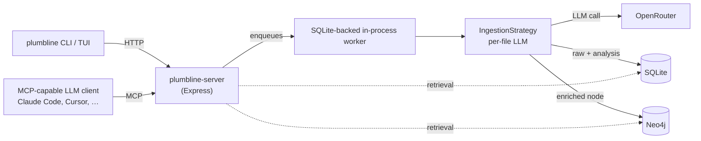

# Plumbline

```
      400+ repos            ~10,000,000 files            1 question
  ┌────┐┌────┐┌────┐┌────┐          │                         │
  │▤▤▤▤││▤▤▤▤││▤▤▤▤││▤▤▤▤│          ▼                         ▼
  │▤▤▤▤││▤▤▤▤││▤▤▤▤││▤▤▤▤│   ═══▶  INDEX ONCE   ═══▶   ask forever
  │▤▤▤▤││▤▤▤▤││▤▤▤▤││▤▤▤▤│      the expensive bit,
  └────┘└────┘└────┘└────┘       exactly one time

┌─ WITHOUT PLUMBLINE ────────────────────────────────────────────────┐
│                                                                    │
│   you    "where do we enforce org-admin access?"                   │
│   agent  "sure, let me just read the codebase real quick"          │
│                                                                    │
│   $ grep -rn 'admin' .                                  4,812 hits │
│   $ grep -rn 'isAdmin' .                                1,203 hits │
│   $ grep -rn 'checkPermission' .                          887 hits │
│   $ grep -rn 'pls' .                                        0 hits │
│                                                                    │
│   context  [##################################]  100%    (x_x)     │
│   files read  214     answer  not found     tokens  $$$$$$$$       │
│                                                                    │
│   agent  "based on my analysis it is probably in utils.ts"         │
│          (it was not in utils.ts)                                  │
│                                                                    │
└────────────────────────────────────────────────────────────────────┘

┌─ WITH PLUMBLINE ───────────────────────────────────────────────────┐
│                                                                    │
│   you    "where do we enforce org-admin access?"                   │
│   agent  *asks the graph*                                          │
│                                                                    │
│   > organizations/(org-admin-only)/layout.tsx       the guard      │
│   > organizations/layout.tsx                        the gap        │
│   > auth/lib/checkAdminOrOwner.ts                   the contract   │
│   > ...6 more, ranked, all of them real                            │
│                                                                    │
│   context  [###-------------------------------]    8%    (^_^)     │
│   files read    9     answer  found          tokens  $             │
│                                                                    │
│   agent  "found it: the layout renders children before the check"  │
│                                                                    │
└────────────────────────────────────────────────────────────────────┘
```

> 📛 **Plumbline** is the project · `plumbline` is the binary it installs. Not a typo.

## 🩸 The problem

- 🐘 agents read **whole files** → context burns on files nobody needed
- 🎯 the file that mattered stays unread — nothing tells them where to look

## 💡 The fix

- 🔍 every file analysed **once** → `purpose` · `summary` · `businessContext` · classes · functions · keywords
- 🕸️ metadata → **Neo4j** · raw content → **local SQLite**
- ⚡ retrieval fuses **meaning + structure** → the agent asks, instead of reading a directory

## 🧪 Benchmark — 17 sibling repos, no shared graph

- ❓ one question, answer **scattered across repos that never import each other**
- 🚫 no monorepo · no workspace · no shared package graph · no call edge to follow
- 🧬 only link between them: same problem class → **same contracts**

### 🌍 The ecosystem

17 React state repos · **one pinned commit each** · later history off-limits 🔒

```
┌────────────────┐┌────────────────┐┌────────────────┐┌────────────────┐┌────────────────┐
│     redux      ││ redux-toolkit  ││  react-redux   ││    reselect    ││  redux-thunk   │
│   477 / 198    ││  1,155 / 708   ││    212 / 64    ││    152 / 90    ││     31 / 7     │
└────────────────┘└────────────────┘└────────────────┘└────────────────┘└────────────────┘
┌────────────────┐┌────────────────┐┌────────────────┐┌────────────────┐┌────────────────┐
│     react      ││     jotai      ││    zustand     ││       db       ││     xyflow     │
│ 7,280 / 4,505  ││   346 / 180    ││    143 / 50    ││  1,574 / 709   ││   693 / 457    │
└────────────────┘└────────────────┘└────────────────┘└────────────────┘└────────────────┘
┌────────────────┐┌────────────────┐┌────────────────┐┌────────────────┐┌────────────────┐
│     query      ││     table      ││     tldraw     ││ redux-devtools ││     router     │
│ 2,351 / 1,118  ││  1,270 / 458   ││ 4,492 / 2,769  ││   895 / 613    ││ 11,976 / 8,801 │
└────────────────┘└────────────────┘└────────────────┘└────────────────┘└────────────────┘
┌────────────────┐┌────────────────┐
│   primitives   ││      zod       │
│   623 / 280    ││   583 / 409    │
└────────────────┘└────────────────┘

   17 repos · 34,253 files · 21,416 code files            each box:  files / code
```

Each case runs against one of two rosters: the original 15, or a later 16 that
drops `redux-thunk` and adds Radix `primitives` and `zod`.

### How a case is built

Most cases — 18 of 23 — are anchored on a **real merged PR whose fix lands after
the pinned commit**, so the defect is live in the tree and the fix is not
reachable from it. The other five are _synthesised_ around a contract several
repositories share, with no single upstream fix. From that anchor, the gold set is
extended to every other repository in the roster that defines, enforces, relies
on, or violates the same contract. Each case carries the benchmark's own
difficulty label, hard (12) or medium (11).

The query is written at the level of _behaviour_, and the identifiers are
deliberately withheld — searching for the words in the question will not find the
answer. From the `partial-key` case:

> A correlated per-parent computation joins its result back to the parent that
> asked for it using a key built only from the computed value itself — never from
> which parent produced it. […] Which files build the join key that drops the
> parent's identity, and which own the key-completeness contract it has to be
> brought in line with?

The instruction is explicit that the answer spans multiple repositories, that the
retriever must not stop at the repository where the symptom appears, and that
every returned path must exist at the pinned commit. Answers are capped at 75
paths across all repositories combined.

Each arm runs in a sandboxed session restricted to its own retrieval surface —
no filesystem, no shell, no network. The only way to see the code is through the
retriever under test. Every arm is Opus 5; `graphtools` is graphify, `embeddings`
is turbovec, and `lsp` is Serena, each served over MCP.

### Results

recall@50 — the share of the gold set found in the first 50 paths of each
answer, as a percentage, taken from each run's own `recall@50`. Every prompt allowed up to 75
paths, so gold files ranked 51–75 are not counted; that changes 11 of the 104
scores below, and the rest are the same at either cutoff. Bold marks the best
score in each row.

| case                                                                                                                     | tier   | anchor PR               | gold               | opus5 + plumbline |        opus5 | opus5 + graphtools | opus5 + embeddings |  opus5 + lsp |
| ------------------------------------------------------------------------------------------------------------------------ | ------ | ----------------------- | ------------------ | ----------------: | -----------: | -----------------: | -----------------: | -----------: |
| [a cache outlives what it was keyed to](benchmarks/crossrepo/a-cache-that-outlives-the-thing-it-was-keyed-to/)           | hard   | _synthesised_           | 6 files / 5 repos  |         **66.7%** |        33.3% |              33.3% |              33.3% |        33.3% |
| [a copy is not the original](benchmarks/crossrepo/a-copy-is-not-the-original/)                                           | hard   | `tldraw` #10248         | 5 files / 4 repos  |         **80.0%** |        40.0% |          **80.0%** |              60.0% |        60.0% |
| [a falsy value is still a value](benchmarks/crossrepo/a-falsy-value-is-still-a-value/)                                   | hard   | `TanStack/query` #11065 | 4 files / 3 repos  |       **75.0% †** |        50.0% |              25.0% |              50.0% |        50.0% |
| [a recipient list edited mid-announcement](benchmarks/crossrepo/a-recipient-list-edited-mid-announcement/)               | hard   | _synthesised_           | 11 files / 5 repos |             72.7% |        63.6% |          **81.8%** |              63.6% |        72.7% |
| [a sameness test stops one level too soon](benchmarks/crossrepo/a-sameness-test-that-stops-one-level-too-soon/)          | hard   | _synthesised_           | 7 files / 5 repos  |           71.4% † |        71.4% |              71.4% |          **85.7%** |        57.1% |
| [delete is not terminal, cascade not scoped](benchmarks/crossrepo/delete-is-not-terminal-and-its-cascade-is-not-scoped/) | hard   | `tldraw` #10298         | 7 files / 4 repos  |          **100%** |     **100%** |           **100%** |              71.4% |     **100%** |
| [failed first load is a one-way door](benchmarks/crossrepo/failed-first-load-is-a-one-way-door/)                         | hard   | `TanStack/db` #1751     | 15 files / 5 repos |        **100% †** |        73.3% |              46.7% |              60.0% |        80.0% |
| [lifecycle fires for a branch never shown](benchmarks/crossrepo/lifecycle-fires-for-a-branch-that-was-never-shown/)      | hard   | `TanStack/router` #8165 | 7 files / 4 repos  |        **100% †** |        57.1% |              42.9% |              42.9% |        85.7% |
| [one effect, two doors, only one guarded](benchmarks/crossrepo/one-effect-two-doors-only-one-guarded/)                   | hard   | `tldraw` #10300         | 7 files / 4 repos  |       **85.7% †** |      71.4% † |              28.6% |              28.6% |    **85.7%** |
| [partial key lets siblings collide](benchmarks/crossrepo/partial-key-lets-siblings-collide/)                             | hard   | `TanStack/db` #1761     | 9 files / 4 repos  |         **66.7%** |        55.6% |              22.2% |              33.3% |        44.4% |
| [the first paint contradicts what was sent](benchmarks/crossrepo/the-first-paint-contradicts-what-was-sent/)             | hard   | _synthesised_           | 8 files / 6 repos  |         **87.5%** |        75.0% |          **87.5%** |          **87.5%** |    **87.5%** |
| [the virtual container is not a node](benchmarks/crossrepo/the-virtual-container-is-not-a-node/)                         | hard   | `react` #37160          | 5 files / 3 repos  |             80.0% |        40.0% |           **100%** |              80.0% |        80.0% |
| [a controlled surface must accept its state back](benchmarks/crossrepo/a-controlled-surface-must-accept-its-state-back/) | medium | `tldraw` #10567         | 4 files / 4 repos  |         **75.0%** |    **75.0%** |          **75.0%** |          **75.0%** |            – |
| [a failure is not an answer](benchmarks/crossrepo/a-failure-is-not-an-answer/)                                           | medium | `tldraw` #10338         | 13 files / 3 repos |       **92.3% †** |        76.9% |              84.6% |                  – |    **92.3%** |
| [a fresh instance that remembers](benchmarks/crossrepo/a-fresh-instance-that-remembers/)                                 | medium | `xyflow` #5991          | 5 files / 4 repos  |             40.0% |    **80.0%** |              40.0% |              60.0% |            – |
| [a gap in the stream is not a delta](benchmarks/crossrepo/a-gap-in-the-stream-is-not-a-delta/)                           | medium | `TanStack/db` #1756     | 5 files / 2 repos  |             80.0% |        80.0% |           **100%** |              80.0% |            – |
| [a link is matched, not parsed](benchmarks/crossrepo/a-link-is-matched-not-parsed/)                                      | medium | `redux-toolkit` #5428   | 8 files / 4 repos  |             62.5% |    **87.5%** |              50.0% |          **87.5%** |            – |
| [a message from another context is not a call](benchmarks/crossrepo/a-message-from-another-context-is-not-a-call/)       | medium | `TanStack/query` #10771 | 5 files / 4 repos  |             60.0% |    **80.0%** |          **80.0%** |              60.0% |            – |
| [ephemeral state outlives its scope](benchmarks/crossrepo/ephemeral-state-outlives-its-scope/)                           | medium | `tldraw` #10509         | 9 files / 9 repos  |             55.6% |    **66.7%** |              44.4% |              44.4% |            – |
| [pending value protocol](benchmarks/crossrepo/pending-value-protocol/)                                                   | medium | _synthesised_           | 9 files / 4 repos  |             77.8% |    **88.9%** |              55.6% |          **88.9%** |            – |
| [the first run writes what it reads](benchmarks/crossrepo/the-first-run-writes-what-it-reads/)                           | medium | `tldraw` #10146         | 5 files / 3 repos  |         **80.0%** |    **80.0%** |          **80.0%** |          **80.0%** |            – |
| [the list shrank but the view did not](benchmarks/crossrepo/the-list-shrank-but-the-view-did-not/)                       | medium | `TanStack/query` #11153 | 4 files / 3 repos  |             25.0% |    **75.0%** |              50.0% |              25.0% |            – |
| [the overview does not share the view filter](benchmarks/crossrepo/the-overview-does-not-share-the-view-filter/)         | medium | `xyflow` #5971          | 5 files / 3 repos  |         **80.0%** |        60.0% |          **80.0%** |              60.0% |            – |
| **mean, hard**                                                                                                           |        |                         |                    |  **82.1%** (n=12) | 60.9% (n=12) |       59.9% (n=12) |       58.0% (n=12) | 69.7% (n=12) |
| **mean, all**                                                                                                            |        |                         |                    |  **74.5%** (n=23) | 68.7% (n=23) |       63.4% (n=23) |       61.7% (n=22) | 71.4% (n=13) |

The chart is the 12 hard cases, where every arm ran every case: Plumbline
**82.1%**, Serena 69.7%, bare Opus 5 60.9%.

```
opus5 + plumbline   ████████████████████████████████░░░░░░░  82.1%  (n=12)
opus5 + lsp         ███████████████████████████░░░░░░░░░░░░  69.7%  (n=12)
opus5               ████████████████████████░░░░░░░░░░░░░░░  60.9%  (n=12)
opus5 + graphtools  ███████████████████████░░░░░░░░░░░░░░░░  59.9%  (n=12)
opus5 + embeddings  ███████████████████████░░░░░░░░░░░░░░░░  58.0%  (n=12)
```

Across all 23 cases Plumbline still has the highest mean recall — 74.5% against
bare Opus 5's 68.7% — but the lead comes from the hard tier:

| retriever             |         hard |       medium |          all |
| --------------------- | -----------: | -----------: | -----------: |
| **opus5 + plumbline** | 82.1% (n=12) | 66.2% (n=11) | 74.5% (n=23) |
| opus5 + lsp           | 69.7% (n=12) |  92.3% (n=1) | 71.4% (n=13) |
| opus5                 | 60.9% (n=12) | 77.3% (n=11) | 68.7% (n=23) |
| opus5 + graphtools    | 59.9% (n=12) | 67.2% (n=11) | 63.4% (n=23) |
| opus5 + embeddings    | 58.0% (n=12) | 66.1% (n=10) | 61.7% (n=22) |

On the 12 hard cases Plumbline averages **82.1%**, twenty-one percentage points
above bare Opus 5 (60.9%), and scores 100% on _delete is not terminal_, _failed first load_
and _lifecycle fires for a branch never shown_. On the 11 medium cases the order flips: bare Opus 5
averages 77.3% to Plumbline's 66.2% and beats it outright on six, most sharply on
_the list shrank_ (75.0% against 25.0%).

The columns do not cover the same cases, so the means above are not strictly
like-for-like. Head-to-head, on only the cases both arms ran:

| baseline           | shared cases | plumbline | baseline | plumbline wins / ties / losses |
| ------------------ | -----------: | --------: | -------: | -----------------------------: |
| opus5              |           23 |     74.5% |    68.7% |                     13 / 4 / 6 |
| opus5 + graphtools |           23 |     74.5% |    63.4% |                     11 / 7 / 5 |
| opus5 + embeddings |           22 |     73.7% |    61.7% |                     11 / 7 / 4 |
| opus5 + lsp        |           13 |     82.9% |    71.4% |                      7 / 6 / 0 |

Serena (`lsp`) comes closest on the mean at 71.4%, but it ran on only 13 cases,
twelve of them hard. On the 13 it shares with Plumbline, Plumbline averages 82.9%
to its 71.4% and never scores lower. Bare Opus 5 beats Plumbline outright on more
cases than any other arm — six of 23, all of them medium — while trailing it by
six points on average.

### Cost per task

Each cell is recall@50 · list-price USD from token counts · wall time. `≈` marks a
cost or time estimated from the session transcript (see that run's
`cost_estimate.json`); `—` means the run did not record that field; `–` means the
arm has no run for that case.

| case                                                                                                                     |          opus5 + plumbline |                    opus5 |       opus5 + graphtools |       opus5 + embeddings |             opus5 + lsp |
| ------------------------------------------------------------------------------------------------------------------------ | -------------------------: | -----------------------: | -----------------------: | -----------------------: | ----------------------: |
| [a cache outlives what it was keyed to](benchmarks/crossrepo/a-cache-that-outlives-the-thing-it-was-keyed-to/)           |    66.7% · $5.98 · 24m 24s |   33.3% · $4.91 · 7m 42s |   33.3% · $4.31 · 7m 46s |   33.3% · $4.44 · 4m 50s |  33.3% · $5.14 · 7m 14s |
| [a copy is not the original](benchmarks/crossrepo/a-copy-is-not-the-original/)                                           |    80.0% · $6.51 · 18m 28s |  40.0% · $7.27 · 15m 25s |  80.0% · $10.28 · 9m 30s |  60.0% · $7.49 · 10m 01s | 60.0% · $13.21 · 5m 49s |
| [a falsy value is still a value](benchmarks/crossrepo/a-falsy-value-is-still-a-value/)                                   |        75.0% † · $3.54 · — |   50.0% · $4.06 · 8m 27s |  25.0% · $10.31 · 9m 04s |   50.0% · $4.19 · 5m 06s |  50.0% · $5.00 · 7m 37s |
| [a recipient list edited mid-announcement](benchmarks/crossrepo/a-recipient-list-edited-mid-announcement/)               |    72.7% · $2.75 · 19m 14s |  63.6% · $4.19 · 10m 49s |   81.8% · $4.53 · 7m 27s |   63.6% · $3.75 · 4m 50s |  72.7% · $6.05 · 8m 28s |
| [a sameness test stops one level too soon](benchmarks/crossrepo/a-sameness-test-that-stops-one-level-too-soon/)          |   71.4% † · $2.60 · 9m 14s |   71.4% · $2.67 · 4m 56s |   71.4% · $4.38 · 5m 44s |   85.7% · $5.83 · 3m 44s |  57.1% · $2.73 · 4m 17s |
| [delete is not terminal, cascade not scoped](benchmarks/crossrepo/delete-is-not-terminal-and-its-cascade-is-not-scoped/) |    100% · $32.70 · 25m 27s |  100% · $21.67 · 28m 51s |    100% · $3.73 · 6m 34s | 71.4% · $13.45 · 16m 46s |  100% · $8.88 · 15m 17s |
| [failed first load is a one-way door](benchmarks/crossrepo/failed-first-load-is-a-one-way-door/)                         | 100% † · ≈$2.83 · ≈40m 52s |  73.3% · $13.12 · 7m 43s |  46.7% · $16.83 · 7m 21s |   60.0% · $3.98 · 5m 06s | 80.0% · $8.99 · 13m 42s |
| [lifecycle fires for a branch never shown](benchmarks/crossrepo/lifecycle-fires-for-a-branch-that-was-never-shown/)      | 100% † · ≈$3.82 · ≈27m 33s |   57.1% · $1.58 · 1m 35s | 42.9% · $19.69 · 17m 17s |   42.9% · $3.96 · 7m 45s |  85.7% · $2.37 · 4m 36s |
| [one effect, two doors, only one guarded](benchmarks/crossrepo/one-effect-two-doors-only-one-guarded/)                   |        85.7% † · $5.24 · — |     71.4% † · $11.33 · — |  28.6% · $24.30 · 9m 12s |   28.6% · $7.23 · 8m 52s |  85.7% · $6.42 · 9m 04s |
| [partial key lets siblings collide](benchmarks/crossrepo/partial-key-lets-siblings-collide/)                             |    66.7% · $3.58 · 11m 13s | 55.6% · $25.33 · 13m 38s |  22.2% · $13.68 · 6m 49s |   33.3% · $3.33 · 4m 18s |  44.4% · $5.83 · 7m 31s |
| [the first paint contradicts what was sent](benchmarks/crossrepo/the-first-paint-contradicts-what-was-sent/)             |     87.5% · $2.63 · 7m 27s |   75.0% · $3.01 · 5m 43s |   87.5% · $3.52 · 6m 19s |   87.5% · $5.18 · 3m 52s |  87.5% · $4.09 · 6m 03s |
| [the virtual container is not a node](benchmarks/crossrepo/the-virtual-container-is-not-a-node/)                         |    80.0% · $3.73 · 15m 44s |  40.0% · $4.17 · 13m 23s |    100% · $1.97 · 5m 39s |   80.0% · $4.57 · 7m 07s |  80.0% · $2.21 · 6m 30s |
| [a controlled surface must accept its state back](benchmarks/crossrepo/a-controlled-surface-must-accept-its-state-back/) |     75.0% · $2.36 · 8m 05s |   75.0% · $3.11 · 5m 47s |   75.0% · $2.05 · 4m 21s |   75.0% · $4.70 · 5m 06s |                       – |
| [a failure is not an answer](benchmarks/crossrepo/a-failure-is-not-an-answer/)                                           |        92.3% † · $2.84 · — |   76.9% · $3.49 · 6m 04s |   84.6% · $5.43 · 3m 59s |                        – |  92.3% · $9.39 · 3m 35s |
| [a fresh instance that remembers](benchmarks/crossrepo/a-fresh-instance-that-remembers/)                                 |    40.0% · $6.66 · 23m 09s |  80.0% · $6.25 · 15m 05s |  40.0% · $3.63 · 10m 31s |   60.0% · $5.12 · 8m 33s |                       – |
| [a gap in the stream is not a delta](benchmarks/crossrepo/a-gap-in-the-stream-is-not-a-delta/)                           |    80.0% · $4.76 · 16m 41s |  80.0% · $6.16 · 14m 04s |    100% · $2.86 · 9m 12s |   80.0% · $4.62 · 7m 49s |                       – |
| [a link is matched, not parsed](benchmarks/crossrepo/a-link-is-matched-not-parsed/)                                      |     62.5% · $2.07 · 6m 01s |   87.5% · $3.48 · 6m 01s |   50.0% · $2.17 · 5m 00s |   87.5% · $3.26 · 4m 06s |                       – |
| [a message from another context is not a call](benchmarks/crossrepo/a-message-from-another-context-is-not-a-call/)       |     60.0% · $1.44 · 8m 31s |   80.0% · $2.69 · 5m 58s |   80.0% · $4.39 · 8m 25s |   60.0% · $2.92 · 3m 54s |                       – |
| [ephemeral state outlives its scope](benchmarks/crossrepo/ephemeral-state-outlives-its-scope/)                           |     55.6% · $2.71 · 9m 55s |  66.7% · $19.86 · 8m 04s |   44.4% · $2.48 · 5m 50s |   44.4% · $4.06 · 3m 28s |                       – |
| [pending value protocol](benchmarks/crossrepo/pending-value-protocol/)                                                   |     77.8% · $2.64 · 8m 52s |   88.9% · $3.68 · 8m 28s |   55.6% · $4.00 · 6m 18s |   88.9% · $4.50 · 4m 06s |                       – |
| [the first run writes what it reads](benchmarks/crossrepo/the-first-run-writes-what-it-reads/)                           |     80.0% · $1.54 · 7m 21s |   80.0% · $3.32 · 7m 57s |   80.0% · $3.61 · 8m 21s |   80.0% · $4.23 · 8m 14s |                       – |
| [the list shrank but the view did not](benchmarks/crossrepo/the-list-shrank-but-the-view-did-not/)                       |    25.0% · $2.98 · 13m 25s |  75.0% · $7.32 · 17m 02s |   50.0% · $3.12 · 9m 22s | 25.0% · $10.66 · 10m 35s |                       – |
| [the overview does not share the view filter](benchmarks/crossrepo/the-overview-does-not-share-the-view-filter/)         |     80.0% · $1.98 · 8m 12s |   60.0% · $3.06 · 6m 52s |   80.0% · $3.43 · 8m 43s |   60.0% · $3.49 · 4m 14s |                       – |
| **total**                                                                                                                |           $107.91 · 5h 09m |         $165.73 · 3h 39m |         $154.70 · 2h 58m |         $114.95 · 2h 22m |         $80.31 · 1h 39m |

### Averages

On the 12 hard cases, where every arm ran every case.

| retriever             | accuracy (mean recall@50) | cost / query | wall time / query | total spend |
| --------------------- | ------------------------: | -----------: | ----------------: | ----------: |
| **opus5 + plumbline** |              82.1% (n=12) | $6.33 (n=12) |    19m 57s (n=10) |      $75.92 |
| opus5 + lsp           |              69.7% (n=12) | $5.91 (n=12) |     8m 00s (n=12) |      $70.92 |
| opus5                 |              60.9% (n=12) | $8.61 (n=12) |    10m 44s (n=11) |     $103.31 |
| opus5 + graphtools    |              59.9% (n=12) | $9.79 (n=12) |     8m 13s (n=12) |     $117.53 |
| opus5 + embeddings    |              58.0% (n=12) | $5.62 (n=12) |     6m 51s (n=12) |      $67.40 |

Plumbline is the slowest arm at 19m 57s per query — every query is a server
round-trip instead of a local `grep`. At $6.33 per query it is the third-cheapest,
behind embeddings ($5.62) and Serena ($5.91).

That cost mean is dragged up by a single run: _delete is not terminal_ cost
**$32.70** because it was launched with `DISABLE_PROMPT_CACHING=1`, so all 6.1M
input tokens billed at the full rate. Every other Plumbline run on the hard cases
allowed in-run caching and came in between $2.60 and $6.51; excluding the
cache-off run, Plumbline averages **$3.93** per query, the cheapest of the five.
The other arms' runs mostly allowed caching too, so the columns are not measured
under one regime and the per-query figures are not strictly like-for-like.

Coverage is uneven and the `n` in each column says so. Recall is complete for
Plumbline, bare and graphtools (23/23); embeddings has 22 (no run on
_a failure is not an answer_), and Serena 13 (no run on ten of the eleven medium
cases). Two Plumbline runs recorded no cost or time — _failed first load_ and
_lifecycle fires for a branch never shown_. Both are estimated from their session
transcripts, up to the moment the gold was first opened, and marked `≈`; _failed
first load_ is priced at Sonnet 5 rates because that is the model it ran on. Three
more Plumbline runs and one bare run recorded no wall time and are left out of the
time average.

The Plumbline column is always the run in the case's
`claudecli_opus5_mcp_plumbline/` directory, except _a gap in the stream_, whose
only Plumbline run is `claudecli_opus5_mcp_plumbline_rejection_selection_v7/`.
Several cases also carry prompt-variant runs in sibling directories (`_v2` …
`_v5`, `_rejection_selection_v7`). None of them are averaged in, and the
canonical run is not the best of them: on _the list shrank_ it scores 25.0% where
one variant reached 75.0%.

† Not like-for-like on cost, recall, or both — an interactive rather than
sandboxed session, a different model or MCP surface, prompt caching left on where
the case required it off, a permission denial mid-run, or gold seen in the same
session. Each run's `result.json` carries its conditions and, where set,
`not_comparable_reason`.

Raw artifacts — prompt, gold set, ranked output, per-run cost — are in
[`benchmarks/crossrepo/`](benchmarks/crossrepo/), one directory per case.

## Quickstart

> Looking for the full CLI reference? Every `plumbline` subcommand, flag, and option lives in **[commands.md](commands.md)**. The Quickstart below is the minimum sequence from zero to a queryable graph.

### Prerequisites

- [Bun](https://bun.sh) ≥ 1.1 — runtime + workspace manager.
- [Docker](https://www.docker.com/) — for the local Neo4j container `plumbline boot` brings up. The document store and job queue are both SQLite and need no container.
- An LLM backend — either an [OpenRouter](https://openrouter.ai) API key (default) or a local [Ollama](https://ollama.com) model. Every per-file analysis call goes through the one you pick.

### Install

One command — checks prerequisites, clones the repo, installs dependencies, and links the `plumbline` binary:

```bash
curl -fsSL https://raw.githubusercontent.com/ByteBell/Plumbline/main/install.sh | bash
```

Verify with `plumbline --help`. (Manual install steps are in [commands.md](commands.md).)

### Fastest path: `plumbline setup`

```bash
plumbline setup
```

One interactive command does everything the manual steps below automate: picks your LLM provider, auto-fills and boots the local stack, optionally indexes a repo (handling private-repo tokens and branch selection), and **auto-wires the MCP endpoint into your editor**. See [SETUP.md](SETUP.md) for the full walkthrough.

The sections below are the manual, step-by-step equivalent — useful if you want to configure each piece yourself or bring your own infrastructure.

### Configure

Two values Plumbline needs — your OpenRouter API key and model. Set them headlessly:

```bash
plumbline set openrouter-api-key sk-or-…
plumbline set openrouter-model anthropic/claude-sonnet-4.6
```

Or skip this step and run `plumbline boot` straight away — on an interactive terminal it opens a setup form to collect these on first run. Running `plumbline set` with no arguments opens the same form at any time.

There is no `.env` file anywhere. `~/.plumbline/config.json` (mode `0600`) is the single source of truth, and `plumbline set` is the only sanctioned way to write to it. If you already run Neo4j and don't want the Docker stack, see [Bring your own infrastructure](#bring-your-own-infrastructure) below.

### Boot

```bash
plumbline boot
```

What happens, in order:

1. **Pre-flight check** — verifies both OpenRouter keys are set. If either is blank and you're in an interactive terminal, Plumbline opens a setup form so you can enter them on the spot, then continues. In a non-interactive context (CI, piped input) it prints the exact `plumbline set …` commands and exits.
2. **Auto-fill** — fills any missing infra config keys with local-Docker defaults; generates a Neo4j password if one isn't set.
3. **Stack up** — `docker compose up -d` brings up `plumbline-neo4j` (a named volume — data persists across reboots). SQLite needs no container; the documents live at `~/.plumbline/data.sqlite` and the queue at `~/.plumbline/queue.db`.
4. **Health gate** — polls `docker compose ps` until all three services report `healthy`.
5. **Server up** — spawns `plumbline-server` (HTTP on `127.0.0.1:8080`, MCP at `/mcp`).

First boot pulls images and can take a couple of minutes. Subsequent boots are fast.

### Index a repo

```bash
plumbline index https://github.com/anthropics/claude-code
# private repo: add --token <github-pat>; never paste the PAT positionally
plumbline ls   # watch state: CREATED → QUEUED → INGESTED → PROCESSING → PROCESSED
```

When the row reads `PROCESSED`, the graph is fully populated and the MCP tools will return results for that repo. Local directories work too: `plumbline ingest /path/to/source-tree`.

### Connect an MCP client

Easiest: **`plumbline mcp install`** auto-detects your installed tools — Claude Code, Cursor, Claude Desktop, Windsurf, VS Code — and writes the correct MCP entry into each one's config (the JSON shape differs per tool; the command handles that and backs up the file first). `plumbline setup` runs this for you on first boot.

To wire Claude Code by hand:

```bash
claude mcp add --transport http plumbline http://127.0.0.1:8080/mcp
```

Or add this under the `mcpServers` key of Claude Desktop's config (or Cursor's `~/.cursor/mcp.json`):

```json
{
  "mcpServers": {
    "plumbline": {
      "type": "http",
      "url": "http://127.0.0.1:8080/mcp"
    }
  }
}
```

The server registers `smart_search`, `keyword_lookup`, and `retrieve_file`, plus a bundled skill at `plumbline://skills/index` that the client can fetch and install once per session for the recommended workflow.

## What Plumbline does

You point `plumbline` at a repo. It clones the source, walks every file, and for each file calls an LLM (via OpenRouter) to extract a structured `FileAnalysis`: a one-paragraph **purpose**, a longer **summary** of what the file does and how it fits the architecture, a **business context** line tying it to the product domain, plus the file's classes, functions, keywords, and imports.

Those outputs are persisted into two stores:

- **Neo4j** receives a `:File` node enriched with `purpose`, `summary`, `businessContext`, `language`, `sha`, and `sizeBytes`, linked via `:HAS_CLASS`, `:HAS_FUNCTION`, `:HAS_KEYWORD`, `:HAS_IMPORT_INTERNAL`, and `:HAS_IMPORT_EXTERNAL` to deduplicated child nodes shared across the whole graph. Fulltext indexes cover purpose+summary, business context, keyword names, and class/function signatures.
- **SQLite** receives the raw file content, language, SHA256, and the full `FileAnalysis` JSON for cite-back and exact retrieval. It is a single file at `~/.plumbline/data.sqlite` — no server, no container.

LLM clients then query that graph through three MCP tools — `smart_search`, `keyword_lookup`, `retrieve_file` — which together cover fused semantic + structural search, reverse entity-to-file lookup, and targeted content reads. They let an agent answer questions like _"Which files implement our retry/backoff policy and where is it configured?"_ without reading the entire repo into context.



## Who this is for

- **Solo engineers and small teams** who want a Claude / Cursor / Continue session to _actually_ know their codebase — not just whatever the tool can fit in a context window — without sending source to a third party.
- **OSS communities and academic research groups** who need a durable, reproducible code-knowledge index they can re-index from a single command.
- **Anyone running an MCP-capable agent on a private codebase** where compliance, IP, or just personal preference rules out hosted RAG-over-your-repo SaaS.

It is **not** a hosted product, not a chat UI, and not a multi-tenant platform. There is exactly one tenant — `orgId="local"` — and the server binds to `127.0.0.1`. If you want hosted, multi-tenant, or commercial-use rights, see the [Enterprise](#enterprise) section.

## ⚙️ How it works

### 📥 Ingest

```
  plumbline index <url>
          │
          ▼
     ┌─────────┐   clone    ┌──────────┐  1 call / file  ┌────────────────┐
     │  queue  ├───────────►│  worker  ├────────────────►│ LLM (per file) │
     └─────────┘  (SQLite)  └────┬─────┘                 └───────┬────────┘
                                 │ raw content                   │ enriched node
                                 ▼                               ▼
                             SQLite 💾                        Neo4j 🕸️
```

- 🧠 **per file →** `purpose` · `summary` · `businessContext` · keywords · imports
- 📍 `classes` / `functions` carry **line ranges** → pull a slice, never the whole file
- ♻️ `pull` re-reads **only changed SHAs** → 💸 cost tracks churn, not repo size

### 🕸️ Graph

```
  :Knowledge ──HAS_FILE──► :File ──┬── HAS_KEYWORD ─────────► :Keyword  🏷️
   (1 per repo)             │      ├── HAS_CLASS ───────────► :Class    🧱
                            │      ├── HAS_FUNCTION ────────► :Function ⚡
                            │      └── HAS_IMPORT_INT/EXT ──► :Module   📦
                   purpose · summary        └──── global: one node per library,
                   businessContext                export or term, across ALL repos
```

- 🔑 `(knowledgeId, relativePath)` unique · fulltext indexes back search
- 🚫 **no cross-file call edges yet** — deliberate: keeps ingest language-agnostic
- 🔌 next strategy adds them behind the same interface

### 🔎 Retrieval — 3 MCP tools @ `127.0.0.1:8080/mcp`

| 🛠️ tool                    | what it does                                                    |
| -------------------------- | --------------------------------------------------------------- |
| 🥇 `smart_search(q, k=20)` | ranked, deduped files across 6 channels — **start here**        |
| 🔁 `keyword_lookup(term)`  | term → matching entities → the files behind each                |
| 📄 `retrieve_file`         | `metadata` · `content` (line range) · `bulk_search` (≤50 files) |

```
  question ──► smart_search ──► retrieve_file:metadata ──► retrieve_file:content ──► ✅ cited answer
```

- ⚡ **2–4 calls** for most questions
- 🚫 no re-clone · 🚫 no full-file dumps · 🚫 no embeddings round-trip

### 🎛️ Running it

- 🪄 `setup` → wizard · 📋 `ls` · 📊 `stats` · ♻️ `pull` · 🗑️ `delete` · 🔌 `boot` / `shutdown` → [commands.md](commands.md)
- 🐳 `boot` spins a local Docker Neo4j — or point at your own, no Docker needed:
  ```bash
  plumbline set neo4j-uri bolt://host:7687   # + neo4j-user, neo4j-password
  ```
- 🏗️ **one** Bun/Express daemon = ingest routes + MCP transport + workers, in-process
- 🎈 CLI is a thin Ink TUI — speaks HTTP only, never touches SQLite or Neo4j → [docs/arch.md](docs/arch.md)

## Configuration reference

Settings live in `~/.plumbline/config.json` and are written exclusively by `plumbline set <key> <value>` (or by first-run auto-fill on `plumbline boot`). Keys:

| Key                  | Purpose                                  | Default                        |
| -------------------- | ---------------------------------------- | ------------------------------ |
| `openrouter-api-key` | API key for per-file LLM analysis        | _(required, blank by default)_ |
| `openrouter-model`   | OpenRouter model slug used for analysis  | _(required)_                   |
| `sqlite-path`        | Path to the SQLite document store        | `~/.plumbline/data.sqlite`     |
| `neo4j-uri`          | Neo4j Bolt URI                           | `bolt://localhost:7687`        |
| `neo4j-user`         | Neo4j auth user                          | `neo4j`                        |
| `neo4j-password`     | Neo4j auth password                      | _(generated on first boot)_    |
| `queue-db-path`      | Path to the SQLite job queue             | `~/.plumbline/queue.db`        |
| `server-port`        | Local HTTP/MCP port                      | `8080`                         |
| `concurrency-github` | Concurrent files analysed per GitHub job | tuned per box                  |
| `log-level`          | Winston log level                        | `info`                         |
| `log-retention-days` | Daily log retention                      | `14`                           |

If a required setting is missing, Plumbline either opens the setup form (interactive terminal) or prints the exact `plumbline set …` command and refuses to boot (non-interactive). It never silently reads `process.env`.

## Benchmark — cal.com, ten commits, one real task each

### Why we built it

Retrieval tools are usually demonstrated on a small repo with a question whose
answer is already visible in the directory names. That proves nothing. We wanted
a test where the target is genuinely hard to find, the ground truth is not ours
to invent, and the same question is put to every retriever under identical
conditions.

So we used [cal.com](https://github.com/calcom/cal.com) — a production Next.js
monorepo of roughly 8,000–10,500 files — and let its own history write the exam.

### How a case is built

For each of ten commits we picked a bug-fix PR merged shortly afterwards, and
turned it into a retrieval task:

- **The query** is the bug as a person would describe it — prose, no filenames,
  no symbol names, no stack trace. For example: _"Settings screens meant for
  whoever runs an organisation can be opened by any signed-in member who types
  the address straight into the browser."_
- **The gold set** is the files that PR actually modified or removed, minus
  tests, mocks, fixtures, lockfiles, locales, migrations, e2e harness, scripts
  and docs/CI. Files the fix _added_ are excluded — they do not exist in the
  indexed tree, so no retriever could return them.
- **The repository is pinned** at a commit _before_ the fix. The answer is in
  there; the fix is not.

Ground truth is therefore decided by what the maintainers changed, not by us.

**Every case is pre-screened for difficulty.** Before a case is admitted, Opus 5
attempts it alone with full filesystem access — `grep`, `find`, the whole
checkout. A case is kept only if that run scores **recall@20 below 80%**. Anything a
strong model can already solve by reading the tree is thrown out, so the
benchmark measures only what unaided search fails at.

Each arm then runs in a fresh, isolated `claude -p` session with
`--strict-mcp-config`, restricted to its own retrieval surface — no filesystem,
no shell, no network. The only way to see the repository is through the
retriever being tested.

### The corpus

| date       | commit       | files  |
| ---------- | ------------ | ------ |
| 2025-07-11 | `14e14289f0` | 8,060  |
| 2025-07-26 | `a1c0daa1b5` | 8,177  |
| 2025-09-09 | `1137047606` | 8,485  |
| 2025-09-12 | `79169de8d8` | 8,508  |
| 2025-10-17 | `9d4522825b` | 8,879  |
| 2025-10-30 | `af61b6d341` | 8,994  |
| 2025-12-01 | `3c46c35b69` | 9,137  |
| 2026-02-09 | `f66fffd13b` | 10,485 |
| 2026-02-17 | `ab4eff1fe1` | 10,278 |
| 2026-02-25 | `4081d11fbe` | 10,333 |

- **91,336** file-instances indexed across the ten commits
- **12,371** distinct paths in the union of all ten, of which **9,187** are code files

The repository is indexed **once per commit**, not once per question.

### Index once, ask later

The expensive part of understanding a repository is reading it. Plumbline pays
that cost a single time: every file is analysed once for what it is _for_ —
purpose, summary, business context, the classes, functions, imports and keywords
it carries — and the result is written into a durable graph.

Questions afterwards are cheap. They traverse a structure that already knows what
the code means, instead of re-deriving that meaning from raw text on every query.
That is the whole design: **one expensive pass, then arbitrarily many cheap
ones.** A benchmark that asks a single question per commit is, if anything,
unkind to this model — the indexing cost is amortised across exactly one query,
where in real use it is amortised across thousands.

### Embeddings are a weak signal for code

One arm (`turbovec`) is a TurboQuant 4-bit vector index built over the same
checkout — pure embedding retrieval. It is the **only arm in the benchmark that
performs worse than the model working alone**, and it loses more cases than it
wins:

|                          | recall@50 | vs. bare Opus 5              |
| ------------------------ | --------- | ---------------------------- |
| Opus 5, filesystem only  | 52.4%     | —                            |
| Opus 5 + embedding index | 51.1%     | 2 W / 4 L / 2 T over 8 cases |

The reason is structural. Embedding similarity rewards text that _reads_ alike.
Two files full of React page boilerplate are near-neighbours in vector space
whether or not they share an authorisation bug; the file that actually governs
their behaviour — a layout, a middleware, a guard — often shares almost no
surface vocabulary with the query. Cosine distance over source text measures
phrasing, and the thing you need to find is defined by _relationships_: what
calls what, what renders inside what, what enforces what. That is a graph
property, and it is not recoverable from a nearest-neighbour lookup.

### Results

recall@50 — the share of each commit's gold set found in the first 50 paths, as a
percentage, re-scored from each run's ranked list against `gold.json`. Every run
returned at most 40 paths except the Plumbline run on `79169de8d8` (52), which has
no gold file after rank 50, so every figure is also that run's full-list recall.
`graphtools` is graphify and `embeddings` is turbovec. Two of the ten indexed
commits, `af61b6d341` and `3c46c35b69`, are not scored here.

| date       | commit       | opus5 + plumbline |       opus5 | opus5 + graphtools | opus5 + embeddings |
| ---------- | ------------ | ----------------: | ----------: | -----------------: | -----------------: |
| 2025-07-11 | `14e14289f0` |         **80.0%** |       60.0% |          **80.0%** |              60.0% |
| 2025-07-26 | `a1c0daa1b5` |         **75.0%** |   **75.0%** |              68.8% |              62.5% |
| 2025-09-09 | `1137047606` |          **100%** |       35.3% |              94.1% |              76.5% |
| 2025-09-12 | `79169de8d8` |         **54.5%** |       45.5% |              36.4% |              36.4% |
| 2025-10-17 | `9d4522825b` |         **85.7%** |       71.4% |              28.6% |              42.9% |
| 2026-02-09 | `f66fffd13b` |         **50.0%** |       37.5% |              37.5% |              37.5% |
| 2026-02-17 | `ab4eff1fe1` |             42.9% |       42.9% |          **57.1%** |              28.6% |
| 2026-02-24 | `4081d11fbe` |             54.8% |       51.6% |              35.5% |          **64.5%** |
| **mean**   |              |   **67.9%** (n=8) | 52.4% (n=8) |        54.7% (n=8) |        51.1% (n=8) |

```
opus5 + plumbline   ██████████████████████████░░░░░░░░░░░░░  67.9%  (n=8)
opus5 + graphtools  █████████████████████░░░░░░░░░░░░░░░░░░  54.7%  (n=8)
opus5               ████████████████████░░░░░░░░░░░░░░░░░░░  52.4%  (n=8)
opus5 + embeddings  ████████████████████░░░░░░░░░░░░░░░░░░░  51.1%  (n=8)
```

Plumbline has the best or tied-best score on six of eight commits and never places
last. The embedding index finishes below the bare model — the only arm that does.
The `79169de8d8` Plumbline cell is that commit's only Plumbline run,
`claudecli_opus5_mcp_plumbline_rejection_selection_v6/`.

Raw artifacts — the query, the gold set, every ranked list, per-run token and
cost accounting — are in [`benchmarks/singlerepo/`](benchmarks/singlerepo/), one
directory per commit. Every number above is recomputable from them.

## Try it against a production index

The benchmarks above run against a hosted Plumbline index. If you want to
reproduce them, or point your own agent at an already-indexed corpus rather than
building one locally, email **admin@bytebell.ai** for a production MCP key.

Include what you are testing and roughly how much you expect to query, and we
will send back an endpoint and key you can drop straight into your MCP client
config — the same shape as the local `plumbline mcp` surface documented above.

## Enterprise

Plumbline — `Plumbline-public` in the [LICENSE](LICENSE) text — is the OSS edition. ByteBell also offers a separately-licensed **Enterprise** edition for organizations that need a commercial-use grant, hardening, and direct support. Enterprise typically includes:

- A commercial-use grant covering use by or on behalf of for-profit entities, including SaaS deployments and revenue-generating applications.
- Hardened multi-tenant deployment patterns, SSO / SCIM, audit logging, and data-isolation guarantees.
- Additional ingestion strategies (cross-file call graphs, dependency-graph extraction, PDF and design-doc ingestion) and additional MCP tools.
- Access to the managed ByteBell knowledge surface and connectors to internal sources (Confluence, Jira, Notion, GitHub Enterprise, …).
- Engineering support and SLAs for production deployments.

To discuss Enterprise licensing, evaluation, or services, contact `team@bytebell.ai`.

## Contributing

Hooks, commit conventions, and pre-push gates are documented in [contributing.md](contributing.md). Architectural rules — file-size limits, tier boundaries, the `README.md` requirement, the Bun-only and OpenRouter-only constraints — live in [CLAUDE.md](CLAUDE.md) and apply to every PR.

## License

Plumbline is released under **AGPL-3.0 with an additional non-commercial use clause** — see [LICENSE](LICENSE) for the authoritative text. Personal, academic, research, and non-profit use are unrestricted under AGPL-3.0 (network-copyleft applies). **Commercial use** is governed by license terms and is covered by the [Enterprise edition](#enterprise) (`team@bytebell.ai`). The running server itself does **not** verify a license; governance is by license terms, not by code. The server is meant for local single-tenant use — no remote network surface; everything binds to `127.0.0.1`.
